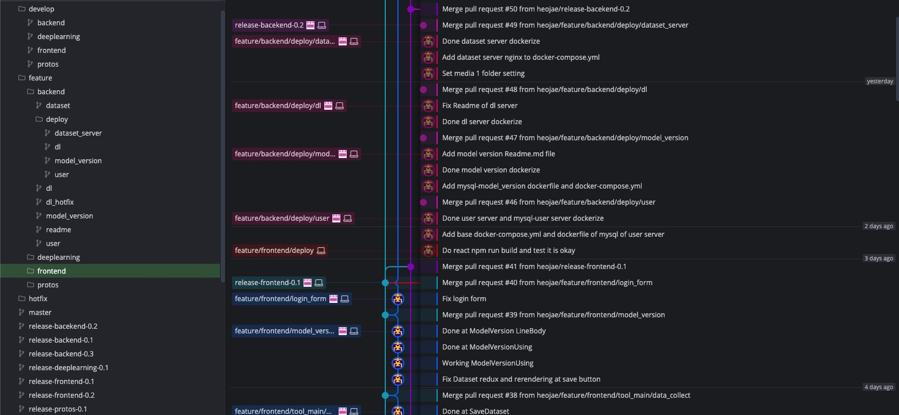

### Food Image Rotation Admin

이 레포의 목적은 `Food Image Rotation(음식이미지 회전)`이라는 주제에 대해서. 

실제로 `딥러닝(deeplearning)`을 어떻게 도입하고, 이를 `API(backend)`로서 서버에 올리며, `웹(frontend)` 를 통해서 올리는 과정을 구현하기 위해서 만든 프로젝트입니다.

`Food Image Rotation(음식이미지 회전)` 이라는 `API` 를 만들고, 이 `API` 를 `관리자(Admin)` 가 웹을 통해서 관리하는 것을 구현할 것입니다.

[초기 시안 기획 및 디자인 링크](https://github.com/heojae/FoodImageRotationAdmin/issues/1)

[결과물 시연 영상](https://github.com/heojae/FoodImageRotationAdmin/issues/43), [Docker Version 시연 영상](https://github.com/heojae/FoodImageRotationAdmin/issues/43#issuecomment-791501187)


--------------

#### 기술 정리 및 관련 요약

- ##### [Deep Learning](https://github.com/heojae/FoodImageRotationAdmin/tree/master/deeplearning)

  `pytorch` 를 통해서, `Food Image Rotation` 이라는 주제에 대해서, 딥러닝 학습한 것을 정리한 것입니다.

- #### [Backend](https://github.com/heojae/FoodImageRotationAdmin/tree/master/backend)

  `GRPC` 와 `python`, `Database` 을 통해서,  `MSA(micro service architecture)` 구조 형태이며, 서로 통신하는 형태로 구현되어 있습니다. 

- #### [Frontend](https://github.com/heojae/FoodImageRotationAdmin/tree/master/frontend)

  `GRPC-WEB`,`React`, `Redux` 등을 활용하여, 웹 페이지가 구현되어 있습니다. 

- #### [Protos](https://github.com/heojae/FoodImageRotationAdmin/tree/master/protos)

  `grpc` 를 통해서, `backend` 와 `frontend` 가 서로 통신하기 위해서, 정의된 `.proto` 파일들입니다. 

  [protobuf 를 통한 통신 정리](https://github.com/heojae/FoodImageRotationAdmin/issues/13)


-----------

#### 시연 해보기

[결과물 시연 영상](https://github.com/heojae/FoodImageRotationAdmin/issues/43), [Docker Version 시연 영상](https://github.com/heojae/FoodImageRotationAdmin/issues/43#issuecomment-791501187)

> `backend` 와 `frontend` 를 통해 구현된 부분들을 `docker compose up` 들을 통해서, 실제로 돌릴 수 있습니다. 

총 2개의 terminal 을 열고, 아래 명령어를 적어주시면, 됩니다. 

그 뒤, `localhost:3000/` 에 접속하여서, 확인을 해보시면 됩니다. 

```shell
# /backend
docker-compose up  # -d # back ground 에서 돌리고 싶을 경우 

# /frontend
docker-compose up  # -d # back ground 에서 돌리고 싶을 경우
```

아래 `gif` 는 위의 경우를 시연하였을 때를 기록한 시연 영상입니다. 


> `backend` 에서 `api_dl server` 까지 다 완료되었을 때, 그 때, 실행을 시키면 됩니다. 


------------

#### Git Flow 를 통한 Branch 관리

[https://www.atlassian.com/git/tutorials/comparing-workflows/gitflow-workflow](https://www.atlassian.com/git/tutorials/comparing-workflows/gitflow-workflow)

[https://gmlwjd9405.github.io/2018/05/11/types-of-git-branch.html](https://gmlwjd9405.github.io/2018/05/11/types-of-git-branch.html)

이 레포는 `git-flow` 를 활용하여서, `branch` 관리가 되어있습니다. 

`master`, `develop`, `feature`, `release`, `hotfix` 등으로 관리되어 있습니다. 

> 추후 관련 작업을 하게 된다면, 참고해주세요. 




