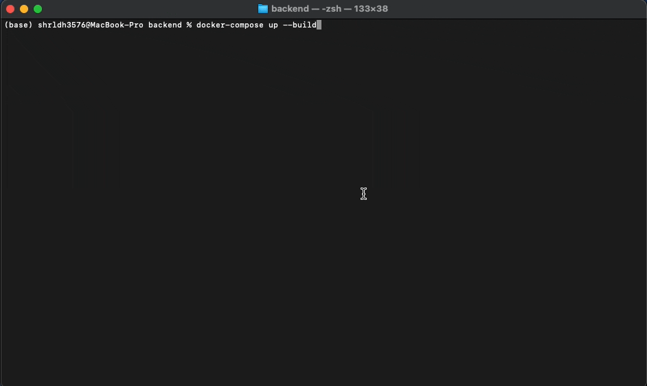

### Backend


#### 기술스택

- [GRPC](https://grpc.io/)
- [AsyncIO](https://docs.python.org/3/library/asyncio.html), [Uvloop](https://github.com/MagicStack/uvloop)
- [Pytorch](https://pytorch.org/)

- [Redis](https://redis.io/), [Mysql](https://www.mysql.com/), [databases](https://github.com/encode/databases)

----------------

#### 참고 이슈

[Proto Buf, 필요한 API에 대한 통신 정리](https://github.com/heojae/FoodImageRotationAdmin/issues/13)

[User Server 설계 및 구상도](https://github.com/heojae/FoodImageRotationAdmin/issues/16)

[Model Version Server 설계및 구상도](https://github.com/heojae/FoodImageRotationAdmin/issues/18)

[DL Server 설계 및 구상도](https://github.com/heojae/FoodImageRotationAdmin/issues/27)

[Dataset Server 설계 및 구상도](https://github.com/heojae/FoodImageRotationAdmin/issues/29)

[Docker 를 통한 컨테이너화](https://github.com/heojae/FoodImageRotationAdmin/issues/44)

[release 0.1 시연 자료 ](https://github.com/heojae/FoodImageRotationAdmin/issues/43)

-------------------


#### 실행 시키기

[release 0.1 시연 자료 ](https://github.com/heojae/FoodImageRotationAdmin/issues/43)  

위 레포는 `Docker` 를 통해서, 간단하게 실행하는 것을 목표로 구현하였으며, `backend` 와 `frontend` 각각 `docker-compose up` 을 통해서, 실행을 시켜야합니다.

```shell
docker-compose up
```

위 명령어를 통해서, 총 9개의 서버들이 동작하게 됩니다. 

- `envoy`

- `user-server`,`mysql-user` ,`redis-server`
- `model_version server`, `mysql-model_version`
- `dl_server`
- `dataset_server`, `nginx-media`,`mysql-dataset`



