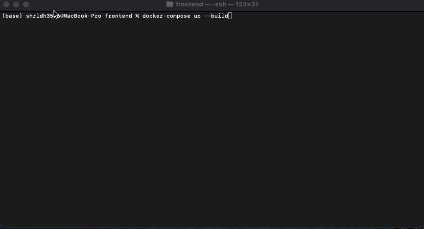
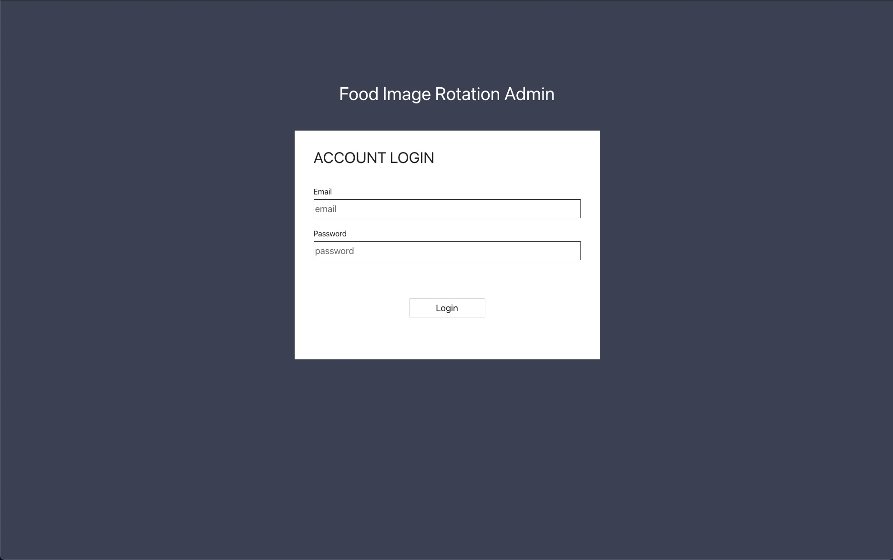
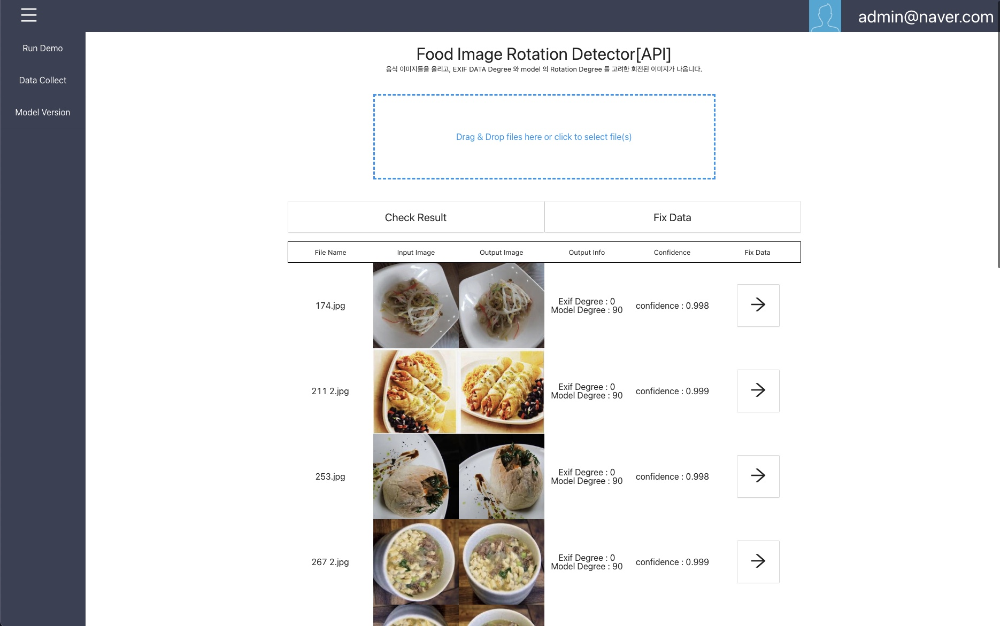
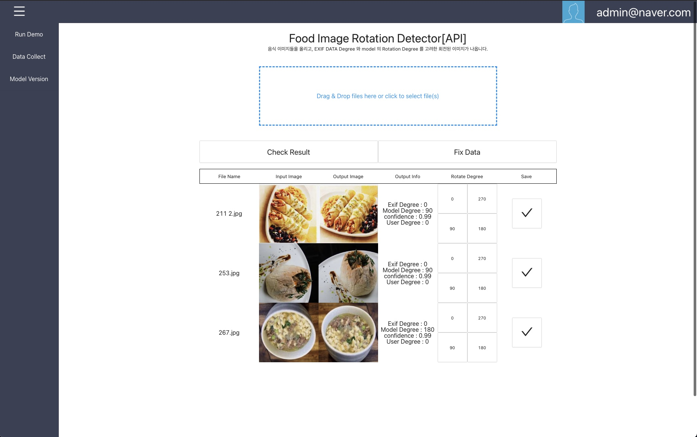
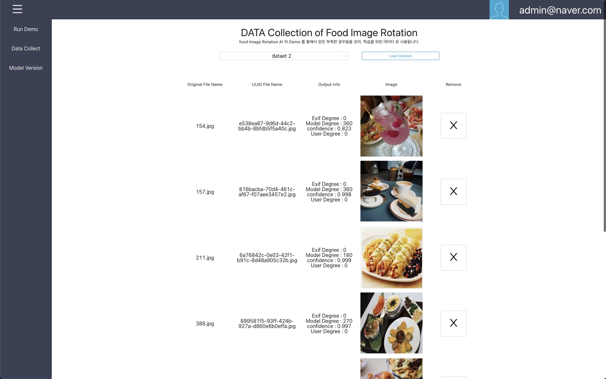
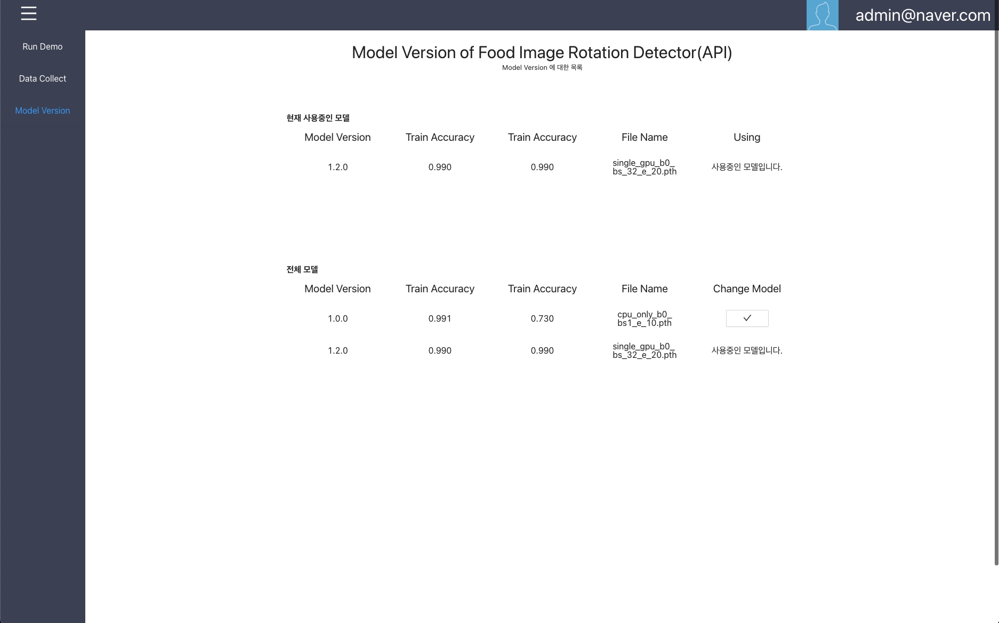

### FrontEnd 


#### 기술 스택

- [GRPC](https://github.com/grpc/grpc), [GRPC - WEB](https://github.com/grpc/grpc-web)
- [React](https://ko.reactjs.org/), [Redux](https://ko.redux.js.org/introduction/getting-started/)
- [Antd](https://ant.design/)

----------------


#### 참고 이슈

[기초 디자인 구현도](https://github.com/heojae/FoodImageRotationAdmin/issues/1)

[프론트 시작전 폴더 구조 설계](https://github.com/heojae/FoodImageRotationAdmin/issues/32)

[Proto Buf 필요한 API 에 대한 정리와 통신정리](https://github.com/heojae/FoodImageRotationAdmin/issues/13)

[Docker 를 통한 컨테이너화 구현 구상](https://github.com/heojae/FoodImageRotationAdmin/issues/44)

[release 0.1 결과물 시연](https://github.com/heojae/FoodImageRotationAdmin/issues/43)


----------------

#### 실행시키기

위 레포는 `Docker` 를 통해서, 간단하게 실행하는 것을 목표로 구현하였으며, `backend` 와 `frontend` 각각 `docker-compose up` 을 통해서, 실행을 시켜야합니다. 

```sh
docker-compose up
```

그리고, `localhost:3000` 으로 접속하시면 됩니다. 




`localhost:3000/login` 으로 `redirect` 될 예정인데, `email : admin@naver.com`, `password: 1234` 을 통해서, 시작하시면 됩니다. 

or 

단순히 `build` 폴더로 이동하여서, 아래 명령어를 적어주어도 됩니다. 

```
python3 -m http.server 3000
```


-----------------

#### 실제 구현 디자인

[release 0.1 결과물 시연](https://github.com/heojae/FoodImageRotationAdmin/issues/43)













